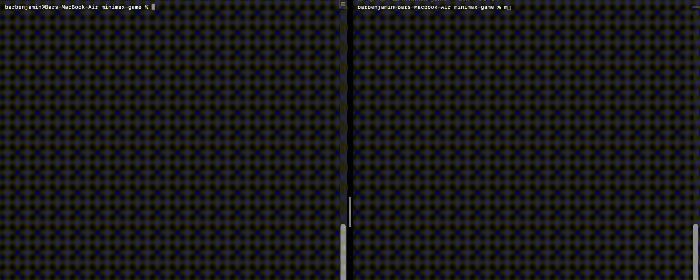
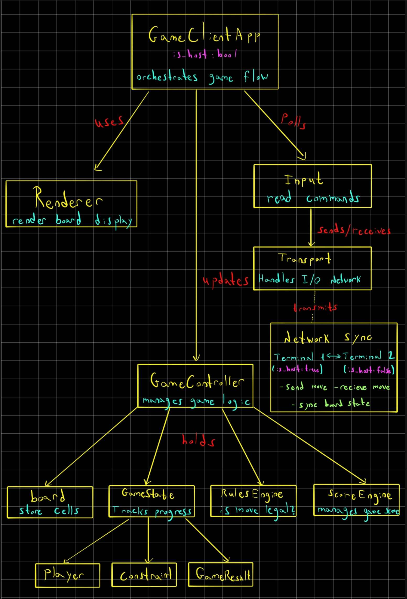

# Minimax Game

A multiplayer turn-based strategy game implemented in C++ with TCP networking.
Two players compete on a 10x10 grid, collecting points while navigating constraints and special cells.
The game ends when no legal moves remain. Highest score wins. 

## Game Demo



## Game Diagram



## Game Rules

Players take turns selecting cells on a shared board. Each cell has a value, and collecting a cell adds its value to your score. After each move, the opponent must choose from either the same row or column you just played.

**Special Cells:**
- **Number Cells**: cells with point values (ranging from -10 to 42)
- **Bombs**: Reduce your score when collected (2 per game)
- **Surprises**: Bonus points (20 or 50 points, 7 per game)
- **Blocked Cells**: Cannot be selected (4 per game)

## Architecture

```
minimax-game/
├── include/minimax/
│   ├── app/              # Application layer (orchestrates game)
│   ├── domain/           # Core game logic (board, rules, scoring)
│   ├── net/              # Networking (TCP protocol, message transport)
│   ├── protocol/         # Message Types
│   ├── ui/               # Terminal UI (renderer, input handling)
│   └── common/           # Logging and Utilities
├── src/                  
└── Makefile              
```

**Key Components:**
- `GameController`: Orchestrates board, state, rules, and scoring
- `Board`: Manages the 10x10 grid and cell generation
- `RulesEngine`: Validates moves based on current constraints
- `ScoreEngine`: Calculates score changes for moves
- `Transport`: Handles TCP communication with length-prefixed messages
- `Renderer`: Terminal-based UI with color coding

## Building and Running

**Requirements:**
- C++17 compiler (g++)
- POSIX-compliant system (Linux/macOS)
- Make

**Build:**
```bash
make clean
make
```

**Run the game:**

Terminal 1 (Host):
```bash
make host
# or with custom settings:
make host SEED=123 PORT=5555
```

Terminal 2 (Client):
```bash
make client
# or connect to specific address:
make client ADDR=127.0.0.1 PORT=5555
```

**Gameplay:**
- Enter row and column numbers when prompted (0-9)
- Legal moves are background-highlighted in the UI
- Current constraint (row/column) shown after each move
- Game displays scores in real-time

**Networking:**
- TCP protocol - each message has header of (length-4 bytes + type-1 byte) and payload.
- Board synchronization between host and client

## Protocol Overview

The game uses a simple binary protocol over TCP - data is serialized and deserialized:

1. **Connection**: Setup Server(Host) and Client
2. **Board Sync**: Host generates board and sends GRID message
3. **Game Loop**: Players exchange MOVE messages
4. **Completion**: No legal moves available - Game Over!
